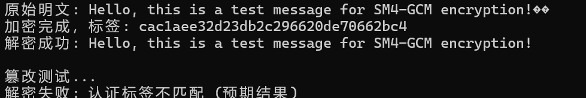

SM4.py文件内实现了SM4算法，SM4采用非平衡Feistel网络（类似SPN结构），每轮对整个分组进行变换，而非传统Feistel的半组处理。加密与解密流程相同，仅轮密钥使用顺序相反。
SM4_T.py使用了T_table方法对其进行了优化，将S盒替换和线性变换L/L'的组合操作预先计算并存储在表中，运行时直接查表代替重复计算，减少CPU计算量，应用了空间换时间策略。预计T_table和T_prime_table算两个表，替换了原来的_tau、_l和_l_prime函数，改为查表操作，大大降低了时间
SM4_AES.cpp使用了AESIN对SM4进行了优化，使用_mm_shuffle_epi8指令加速S盒替换，使用SIMD寄存器(__m128i)并行处理数据，利用AES-NI相关指令优化线性变换，减少内存访问，更多使用寄存器操作
SM4_AVGF.cpp利用GFNI指令集和AVX-512对代码进行了优化，使用_mm512_gf2p8affine_epi64_epi8指令高效实现S盒替换，相比传统查表法，减少内存访问，提高吞吐量。使用512位寄存器(__m512i)同时处理8个SM4块(128字节)，使用_mm512_rol_epi32(vprold)指令高效实现循环左移，减少指令数量，提高指令级并行度
SM4_GCM.cpp中为基于SM4的实现，做SM4-GCM工作模式的软件优化实现，GCM提供认证加密功能，同时保证数据的机密性和完整性。以下为运行结果
成功检测到密文被篡改，拒绝输出错误结果，符合GCM模式的安全设计。
正确处理各种长度和字符集的明文，生成有效的认证标签，可靠检测数据篡改，保持加密/解密的正确性